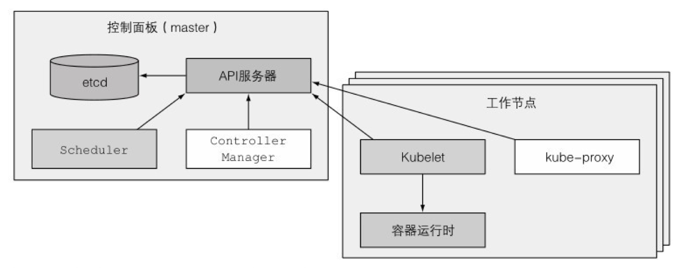

# 使用kubeadm一键部署k8s集群
## 1. k8s集群简介
### 1.1 架构
在硬件级别，一个k8s集群由很多节点组成，这些节点被分成两种类型：
- **主节点**： 它承载着k8s控制和管理整个集群系统的控制面板
- **工作节点**：他们运行用户实际部署的应用
下图展示了运行在这两组节点上的组件，接下里会进一步说明：
 
[^来源1: 来自k8s in action图1.9]

### 1.2 控制面板
用于控制集群并使它工作，它包含多个组件，组件可以运行在单主节点上火诸葛通过副本分别部署在多个节点上以确保高可用：
- **k8s API Server**: 负责组件间通信
- **Scheduler**: 负责调度应用
- **Controller Manager**: 执行集群级别的功能，如复制组件、持续跟踪工作节点、处理节点失败等
- **etcd**: 一个可靠的分布式数据存储
### 1.3 工作节点
运行容器应用的机器，运行、监控和管理应用服务的任务由以下组件完成：
- **CRI （容器运行时）**: Docker、rkt或其他容器类型
- **Kubelet** 它与API Server通信并管理它所在节点的容器
- **K8s Server Proxy(kube-proxy)** 它负责组件之间的负载均衡网络

## 2. 搭建k8s集群
### 2.1 安装软件
在环境准备章节已经安装的容器运行时Docker，并且关闭了SELinux、Swap、防火墙等。下面进入安装k8s集群的操作流程，需要安装的二进制文件：
- **kubeadm** : 工具类，可以创建符合最佳实践的最小可行K8s集群
- **kubelet**： 工作节点上的主要服务
- **kubectl**: k8s命令行工具，负责与集群交互

```shell
# 配置yum源, 使用aliyun
$ cat <<EOF > /etc/yum.repos.d/kubernetes.repo
[kubernetes]
name=Kubernetes
baseurl=https://mirrors.aliyun.com/kubernetes/yum/repos/kubernetes-el7-x86_64/
enabled=1
gpgcheck=1
repo_gpgcheck=1
gpgkey=https://mirrors.aliyun.com/kubernetes/yum/doc/rpm-package-key.gpg
        https://mirrors.aliyun.com/kubernetes/yum/doc/yum-key.gpg
EOF

$ yum install -y kubeadm kubelet kubectl
$ systemctl enable kubelet.service
```

### 2.2 内核优化
```shell
$ cat > kubernetes.conf <<EOF
net.bridge.bridge-nf-call-iptables=1
net.bridge.bridge-nf-call-ip6tables=1
net.ipv4.ip_forward=1
net.ipv4.tcp_tw_recycle=0
net.ipv4.neigh.default.gc_thresh1=1024
net.ipv4.neigh.default.gc_thresh1=2048
net.ipv4.neigh.default.gc_thresh1=4096
vm.swappiness=0
vm.overcommit_memory=1
vm.panic_on_oom=0
fs.inotify.max_user_instances=8192
fs.inotify.max_user_watches=1048576
fs.file-max=52706963
fs.nr_open=52706963
net.ipv6.conf.all.disable_ipv6=1
EOF

$ cp kubernetes.conf /etc/sysctl.d/kubernetes.conf
$ sysctl -p /etc/sysctl.d/kubernetes.conf
```
> 将桥接的IPv4流量传递到iptables的链
> net.bridge.bridge-nf-call-ip6tables = 1 
> net.bridge.bridge-nf-call-iptables = 1

### 2.3 初始化集群master节点
**在master节点执行初始化操作**
```shell
$ kubeadm init \
--apiserver-advertise-address=172.31.1.6 \
--control-plane-endpoint=master01 \
--image-repository registry.aliyuncs.com/google_containers \
--service-cidr=10.96.0.0/16 \
--pod-network-cidr=10.244.0.0/16 | tee kubeadm-init.log
```
> - apiserver-advertise-address kubeadm 使用 eth0 的默认网络接口（通常是内网IP）做为 Master 节点的 advertise address ，如果我们想使用不同的网络接口，可以使用 --apiserver-advertise-address=\<ip-address\> 参数来设置
> - control-plane-endpoint 
> - service-cidr
> - pod-network-cidr: 指定pod网络的IP地址范围，准备使用Flannel，需要指定为10.244.0.0/16

**分析一下init的输出日志**
`cat ./kubeadm-init.log`
```shell
#--- 版本号 ---
[init] Using Kubernetes version: v1.23.1
#--- 预检操作，通不过会显示原因，拉取必要的image镜像，也可以使用相关命令预先拉取 ---
[preflight] Running pre-flight checks
[preflight] Pulling images required for setting up a Kubernetes cluster
[preflight] This might take a minute or two, depending on the speed of your internet connection
[preflight] You can also perform this action in beforehand using 'kubeadm config images pull'
#--- 生成相关证书，这些在手工执行时也需要做 ---
[certs] Using certificateDir folder "/etc/kubernetes/pki"
[certs] Generating "ca" certificate and key
[certs] Generating "apiserver" certificate and key
[certs] apiserver serving cert is signed for DNS names [kubernetes kubernetes.default kubernetes.default.svc kubernetes.default.svc.cluster.local master01] and IPs [10.96.0.1 172.31.1.6]
[certs] Generating "apiserver-kubelet-client" certificate and key
[certs] Generating "front-proxy-ca" certificate and key
[certs] Generating "front-proxy-client" certificate and key
[certs] Generating "etcd/ca" certificate and key
[certs] Generating "etcd/server" certificate and key
[certs] etcd/server serving cert is signed for DNS names [localhost master01] and IPs [172.31.1.6 127.0.0.1 ::1]
[certs] Generating "etcd/peer" certificate and key
[certs] etcd/peer serving cert is signed for DNS names [localhost master01] and IPs [172.31.1.6 127.0.0.1 ::1]
[certs] Generating "etcd/healthcheck-client" certificate and key
[certs] Generating "apiserver-etcd-client" certificate and key
[certs] Generating "sa" key and public key
# --- 生成配置文件 ----
[kubeconfig] Using kubeconfig folder "/etc/kubernetes"
[kubeconfig] Writing "admin.conf" kubeconfig file
[kubeconfig] Writing "kubelet.conf" kubeconfig file
[kubeconfig] Writing "controller-manager.conf" kubeconfig file
[kubeconfig] Writing "scheduler.conf" kubeconfig file
# --- 启动kubelet ---
[kubelet-start] Writing kubelet environment file with flags to file "/var/lib/kubelet/kubeadm-flags.env"
[kubelet-start] Writing kubelet configuration to file "/var/lib/kubelet/config.yaml"
[kubelet-start] Starting the kubelet
# --- 通过manifest启动控制面板相关的几个组件 ---
[control-plane] Using manifest folder "/etc/kubernetes/manifests"
[control-plane] Creating static Pod manifest for "kube-apiserver"
[control-plane] Creating static Pod manifest for "kube-controller-manager"
[control-plane] Creating static Pod manifest for "kube-scheduler"
[etcd] Creating static Pod manifest for local etcd in "/etc/kubernetes/manifests"
[wait-control-plane] Waiting for the kubelet to boot up the control plane as static Pods from directory "/etc/kubernetes/manifests". This can take up to 4m0s
[apiclient] All control plane components are healthy after 5.001353 seconds
[upload-config] Storing the configuration used in ConfigMap "kubeadm-config" in the "kube-system" Namespace
# --- 创建ConfigMap对象 ---
[kubelet] Creating a ConfigMap "kubelet-config-1.23" in namespace kube-system with the configuration for the kubelets in the cluster
NOTE: The "kubelet-config-1.23" naming of the kubelet ConfigMap is deprecated. Once the UnversionedKubeletConfigMap feature gate graduates to Beta the default name will become just "kubelet-config". Kubeadm upgrade will handle this transition transparently.
# --- 跳过上次证书操作 ---
[upload-certs] Skipping phase. Please see --upload-certs
# --- 给节点打便签 ---
[mark-control-plane] Marking the node master01 as control-plane by adding the labels: [node-role.kubernetes.io/master(deprecated) node-role.kubernetes.io/control-plane node.kubernetes.io/exclude-from-external-load-balancers]
[mark-control-plane] Marking the node master01 as control-plane by adding the taints [node-role.kubernetes.io/master:NoSchedule]
# --- bootstrap-token ---
[bootstrap-token] Using token: yq6efh.i78zfnq6wcxodte0
[bootstrap-token] Configuring bootstrap tokens, cluster-info ConfigMap, RBAC Roles
[bootstrap-token] configured RBAC rules to allow Node Bootstrap tokens to get nodes
[bootstrap-token] configured RBAC rules to allow Node Bootstrap tokens to post CSRs in order for nodes to get long term certificate credentials
[bootstrap-token] configured RBAC rules to allow the csrapprover controller automatically approve CSRs from a Node Bootstrap Token
[bootstrap-token] configured RBAC rules to allow certificate rotation for all node client certificates in the cluster
[bootstrap-token] Creating the "cluster-info" ConfigMap in the "kube-public" namespace
# --- 更新配置文件 ---
[kubelet-finalize] Updating "/etc/kubernetes/kubelet.conf" to point to a rotatable kubelet client certificate and key
# --- 增加两个插件 ---
[addons] Applied essential addon: CoreDNS
[addons] Applied essential addon: kube-proxy

Your Kubernetes control-plane has initialized successfully!

To start using your cluster, you need to run the following as a regular user:

  mkdir -p $HOME/.kube
  sudo cp -i /etc/kubernetes/admin.conf $HOME/.kube/config
  sudo chown $(id -u):$(id -g) $HOME/.kube/config

Alternatively, if you are the root user, you can run:

  export KUBECONFIG=/etc/kubernetes/admin.conf

You should now deploy a pod network to the cluster.
Run "kubectl apply -f [podnetwork].yaml" with one of the options listed at:
  https://kubernetes.io/docs/concepts/cluster-administration/addons/

You can now join any number of control-plane nodes by copying certificate authorities
and service account keys on each node and then running the following as root:

# --- 加入master节点 ---
  kubeadm join master01:6443 --token yq6efh.i78zfnq6wcxodte0 \
	--discovery-token-ca-cert-hash sha256:acb2bcfc85d14ef2be6f1042ee40a8c2232662a4bd1873181358ea1837bdf29b \
	--control-plane

Then you can join any number of worker nodes by running the following on each as root:

# --- 加入工作节点 ---
kubeadm join master01:6443 --token yq6efh.i78zfnq6wcxodte0 \
	--discovery-token-ca-cert-hash sha256:acb2bcfc85d14ef2be6f1042ee40a8c2232662a4bd1873181358ea1837bdf29b
```

**显示下载的镜像**

```shell
$ docker image ls
REPOSITORY                                                        TAG       IMAGE ID       CREATED        SIZE
registry.aliyuncs.com/google_containers/kube-apiserver            v1.23.1   b6d7abedde39   11 days ago    135MB
registry.aliyuncs.com/google_containers/kube-proxy                v1.23.1   b46c42588d51   11 days ago    112MB
registry.aliyuncs.com/google_containers/kube-scheduler            v1.23.1   71d575efe628   11 days ago    53.5MB
registry.aliyuncs.com/google_containers/kube-controller-manager   v1.23.1   f51846a4fd28   11 days ago    125MB
registry.aliyuncs.com/google_containers/etcd                      3.5.1-0   25f8c7f3da61   7 weeks ago    293MB
registry.aliyuncs.com/google_containers/coredns                   v1.8.6    a4ca41631cc7   2 months ago   46.8MB
registry.aliyuncs.com/google_containers/pause                     3.6       6270bb605e12   4 months ago   683kB
```

**查看集群信息和节点信息**
```shell
$ kubectl cluster-info
Kubernetes control plane is running at https://master01:6443
CoreDNS is running at https://master01:6443/api/v1/namespaces/kube-system/services/kube-dns:dns/proxy

To further debug and diagnose cluster problems, use 'kubectl cluster-info dump'.

$ kubectl get nodes -o wide
NAME       STATUS     ROLES                  AGE   VERSION   INTERNAL-IP   EXTERNAL-IP   OS-IMAGE                KERNEL-VERSION                CONTAINER-RUNTIME
master01   NotReady   control-plane,master   27m   v1.23.1   172.31.1.6    <none>        CentOS Linux 7 (Core)   5.4.168-1.el7.elrepo.x86_64   docker://20.10.12
```

> 显示集群中只有一个节点，且状态是NotReady，原因是网络，需要安装网络插件

### 2.4 将节点加入集群
在node01和node02上分别执行加入集群的操作(确保配置了正确的hostname)
```shell
$ kubeadm join master01:6443 --token yq6efh.i78zfnq6wcxodte0 \
--discovery-token-ca-cert-hash sha256:acb2bcfc85d14ef2be6f1042ee40a8c2232662a4bd1873181358ea1837bdf29b
[preflight] Running pre-flight checks
[preflight] Reading configuration from the cluster...
[preflight] FYI: You can look at this config file with 'kubectl -n kube-system get cm kubeadm-config -o yaml'
[kubelet-start] Writing kubelet configuration to file "/var/lib/kubelet/config.yaml"
[kubelet-start] Writing kubelet environment file with flags to file "/var/lib/kubelet/kubeadm-flags.env"
[kubelet-start] Starting the kubelet
[kubelet-start] Waiting for the kubelet to perform the TLS Bootstrap...

This node has joined the cluster:
* Certificate signing request was sent to apiserver and a response was received.
* The Kubelet was informed of the new secure connection details.

Run 'kubectl get nodes' on the control-plane to see this node join the cluster.
```

> 如果报错，可以执行kubeadm reset，然后执行以下命令情况iptables
> iptables -F && iptables -t nat -F && iptables -t mangle -F && iptables -X

**再次查看集群节点情况，节点已经加入，状态是NotReady**

```shell
$ kubectl get nodes
NAME       STATUS     ROLES                  AGE   VERSION
master01   NotReady   control-plane,master   52m   v1.23.1
node01     NotReady   <none>                 17s   v1.23.1
node02     NotReady   <none>                 17m   v1.23.1
```

### 2.5 部署网络插件
这里使用flannel，在master01节点执行：
```shell
$ kubectl apply -f https://raw.githubusercontent.com/coreos/flannel/master/Documentation/kube-flannel.yml
Warning: policy/v1beta1 PodSecurityPolicy is deprecated in v1.21+, unavailable in v1.25+
podsecuritypolicy.policy/psp.flannel.unprivileged created
clusterrole.rbac.authorization.k8s.io/flannel created
clusterrolebinding.rbac.authorization.k8s.io/flannel created
serviceaccount/flannel created
configmap/kube-flannel-cfg created
daemonset.apps/kube-flannel-ds created
```
> 这里有个警告，关于apiVersion的，在v1.25之后将废除，当前版本我们用的是v1.23

再次查看node信息，状态变为Ready
```shell
$ kg nodes
NAME       STATUS   ROLES                  AGE   VERSION
master01   Ready    control-plane,master   62m   v1.23.1
node01     Ready    <none>                 10m   v1.23.1
node02     Ready    <none>                 27m   v1.23.1
```

查看当前所有的pod信息
```shell
$ kg pod -A -o wide
NAMESPACE     NAME                               READY   STATUS    RESTARTS   AGE     IP           NODE       NOMINATED NODE   READINESS GATES
kube-system   coredns-6d8c4cb4d-2w5gv            1/1     Running   0          63m     10.244.0.2   master01   <none>           <none>
kube-system   coredns-6d8c4cb4d-zj8md            1/1     Running   0          63m     10.244.0.3   master01   <none>           <none>
kube-system   etcd-master01                      1/1     Running   1          63m     172.31.1.6   master01   <none>           <none>
kube-system   kube-apiserver-master01            1/1     Running   1          63m     172.31.1.6   master01   <none>           <none>
kube-system   kube-controller-manager-master01   1/1     Running   0          63m     172.31.1.6   master01   <none>           <none>
kube-system   kube-flannel-ds-hc9nw              1/1     Running   0          7m57s   172.31.1.2   node02     <none>           <none>
kube-system   kube-flannel-ds-jmq25              1/1     Running   0          7m57s   172.31.1.5   node01     <none>           <none>
kube-system   kube-flannel-ds-svc82              1/1     Running   0          7m57s   172.31.1.6   master01   <none>           <none>
kube-system   kube-proxy-5m2hj                   1/1     Running   0          11m     172.31.1.5   node01     <none>           <none>
kube-system   kube-proxy-smw9t                   1/1     Running   0          63m     172.31.1.6   master01   <none>           <none>
kube-system   kube-proxy-w8x2r                   1/1     Running   0          28m     172.31.1.2   node02     <none>           <none>
kube-system   kube-scheduler-master01            1/1     Running   1          63m     172.31.1.6   master01   <none>           <none>
```


## 3 额外设置
### 3.1 命令补全
[Optional kubectl configurations and plugins](https://kubernetes.io/docs/tasks/tools/install-kubectl-linux/#optional-kubectl-configurations-and-plugins)
安装自动补全功能
```shell
$ yum install -y bash-completion
```
使kubectl自动补全
```shell
$ echo 'source <(kubectl completion bash)' >>~/.bashrc
```
使kubectl别名也支持自动补全
```shell
$ echo 'complete -F __start_kubectl k' >>~/.bashrc
```
### 3.2 命令别名
创建别名文件`~/.bash_aliases`
```shell
alias k=kubectl
alias kg='k get'
alias kget=kg
alias ka='k apply'
alias ke='k edit'
alias kedit=ke
alias kd='k describe'
alias kdesc=kd
alias kdel='k delete'
```
加入`~/.bashrc`文件
```shell
if [ -f ~/.bash_aliases ]; then
	. ~/.bash_aliases
fi
```

## 4 最后
这里使用kubeadm工具搭建一个简单的k8s集群，该集群不是高可用的，一些证书也都是默认设置的，用于开发环境和学习环境是足够了，接下里进入学习k8s的旅程。等对k8s有了一定了解之后，尝试“手撕”安装k8s集群，期待！